# Laporan Proyek Machine Learning - Sinta Ezra Wati Gulo

## Project Overview
### Latar Belakang
Sistem rekomendasi telah menjadi komponen kunci dalam industri hiburan digital, khususnya dalam membantu pengguna menemukan konten yang relevan dari ribuan pilihan yang tersedia. Ketika jumlah film yang tersedia terus bertambah setiap hari, pengguna cenderung mengalami kesulitan dalam memilih konten yang sesuai dengan preferensi mereka. Hal ini tidak hanya berdampak pada pengalaman pengguna, tetapi juga dapat mengurangi waktu tonton, menurunkan kepuasan pengguna, dan meningkatkan risiko perpindahan ke platform kompetitor.

Masalah ini perlu diselesaikan karena ketidakmampuan pengguna dalam menemukan konten yang relevan secara cepat dapat menurunkan tingkat kepuasan dan retensi pengguna pada platform hiburan digital. Untuk itu, sistem rekomendasi menjadi solusi penting yang memungkinkan personalisasi konten bagi setiap pengguna secara efisien.

Salah dua pendekatan populer dalam sistem rekomendasi adalah Content-Based Filtering (CBF) dan Collaborative Filtering (CF). CBF bekerja dengan merekomendasikan item berdasarkan kesamaan atribut konten—seperti genre atau tag—dengan item yang telah disukai atau ditonton oleh pengguna sebelumnya. Sementara itu, CF menyarankan item berdasarkan kesamaan perilaku pengguna, yakni dengan melihat pola rating pengguna lain yang memiliki preferensi serupa.

Keberhasilan penerapan sistem rekomendasi telah dibuktikan dalam praktik industri. Netflix, misalnya, menerapkan sistem rekomendasi yang memadukan pendekatan content-based dan collaborative filtering untuk mempertahankan atensi pengguna dan mengurangi churn rate (Gomez-Uribe & Hunt, 2015). Studi komprehensif oleh Bobadilla et al. (2013) juga menunjukkan bahwa sistem rekomendasi memiliki peran penting dalam meningkatkan efisiensi pencarian informasi dan pengalaman pengguna secara keseluruhan.

Dengan demikian, penerapan sistem rekomendasi dalam domain film tidak hanya meningkatkan pengalaman pengguna, tetapi juga berdampak langsung terhadap keberhasilan bisnis dan loyalitas pengguna terhadap platform.

### Referensi

Bobadilla, J., Ortega, F., Hernando, A., & Gutiérrez, A. (2013). Recommender systems survey. *Knowledge-Based System, 46*, 109–132. [https://doi.org/10.1016/j.knosys.2013.03.012](https://doi.org/10.1016/j.knosys.2013.03.012)

Gomez-Uribe, C. A., & Hunt, N. (2015). The Netflix recommender system: Algorithms, business value, and innovation. *ACM Transactions on Management Information Systems (TMIS), 6*(4), 1–19. [https://doi.org/10.1145/2843948](https://doi.org/10.1145/2843948)

## Business Understanding
### Problem Statements
- Pengguna mengalami kesulitan menemukan film yang sesuai dengan preferensi pribadi karena banyaknya pilihan film yang tersedia.
- Ketiadaan sistem yang mampu menyajikan rekomendasi film secara personal menyebabkan pengguna merasa bosan dan berpotensi meninggalkan platform.

### Goals
- Membangun sistem rekomendasi film yang dapat memberikan saran film sesuai dengan preferensi pengguna berdasarkan histori tontonan dan karakteristik film (genre dan tag).
- Menyediakan top-N rekomendasi film yang mudah diakses agar pengguna tidak kesulitan memilih film yang sesuai.

### Solution Statements
Untuk mencapai tujuan tersebut, dalam proyek ini digunakan dua pendekatan sistem rekomendasi, yaitu:
- Content-Based Filtering: Sistem merekomendasikan film berdasarkan kemiripan konten, yaitu genre dan tag film, dengan film yang telah disukai pengguna. Pendekatan ini menggunakan data metadata film untuk menghitung kemiripan antar film.
- Collaborative Filtering: Sistem merekomendasikan film berdasarkan pola kesamaan preferensi antar pengguna, yaitu film-film yang disukai oleh pengguna dengan profil preferensi mirip akan direkomendasikan.

## Data Understanding
Proyek ini menggunakan dataset Movie Rating Dataset yang dapat diakses melalui Kaggle pada link berikut [Movie Rating Dataset](https://www.kaggle.com/datasets/rockyt07/movie-rating-dataset?select=movies.csv). Dataset ini terdiri dari 3 file yaitu movies.csv, ratings.csv, dan tags.csv.

### Variabel-variabel pada Movie Rating Dataset adalah sebagai berikut:
1. movies.csv
   - movieId: ID unik untuk setiap film.
   - title: Judul film yang mencakup tahun rilis dalam tanda kurung untuk mengenali film secara spesifik, terutama jika terdapat film dengan nama serupa yang dirilis di tahun berbeda.
   - genres: Kategori/genre film, dipisahkan oleh karakter | jika lebih dari satu genre.
2. ratings.csv
   - userId: ID unik untuk setiap user.
   - movieId: ID unik untuk setiap film.
   - rating: Menunjukkan skor atau penilaian yang diberikan oleh pengguna terhadap suatu film dengan skala 0-5.
   - timestamp: Mencatat waktu ketika rating diberikan.
3. tags.csv
   - userId: ID unik untuk setiap user.
   - movieId: ID unik untuk setiap film.
   - tag: Menunjukkan ata kunci atau frasa pendek yang diberikan oleh pengguna untuk menggambarkan film tersebut.
   - timestamp: Mencatat waktu ketika tag diberikan.

### Exploratory Data Analysis 
1. Data df_movies
   - Informasi df_movies
     <br>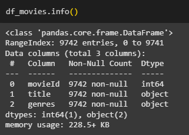
     <br>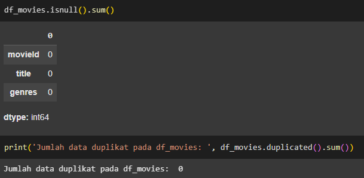
     - Ada 9.742 baris dalam dataset.
     - Terdapat 3 kolom yaitu `movieId`, `title`dan `genres`.
     - Tidak ada missing value dan data duplikat.
   - Distribusi Film per Tahun
     <br>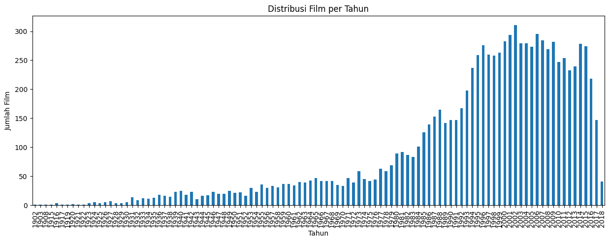
     <br>Grafik di atas menunjukkan distribusi film dari tahun ke tahun dan menunjukkan peningkatan semakin bertambahnya tahun terutama disekitar tahun 2008-2010.
   - Distribusi Genre
     <br>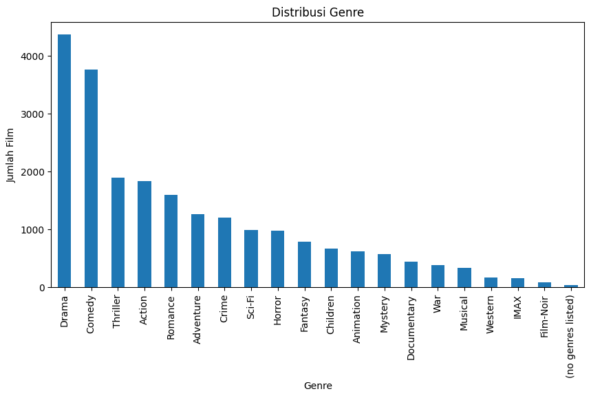
     <br>Secara keseluruhan, grafik di atas menunjukkan distribusi genre dari yang palng dominan hingga yang paling sedikit pada data., dengan genre paling dominan adalah Drama dan terdapat genre dengan nama (no genres listed) yang sebaiknya ditangani untuk persiapan pemodelan.
   - Jumlah Genre per Film
     <br>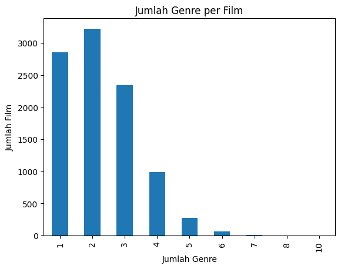
     <br>Grafik menunjukkan sebagian besar film hanya memiliki 1 hingga 3 genre, menunjukkan bahwa mayoritas film memiliki fokus genre yang jelas, dimana film dengan 2 genre adalah yang paling umum.
2. Data df_ratings
   - Informasi df_ratings
     <br>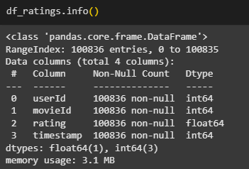
     <br>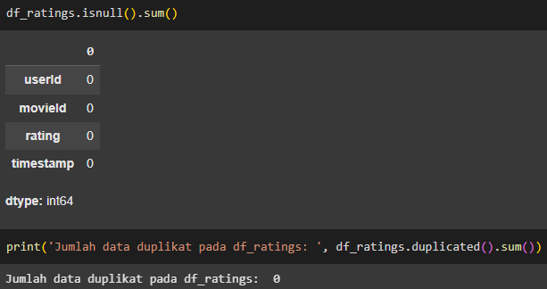
     - Ada 100.836 baris dalam dataset.
     - Terdapat 4 kolom yaitu `userId`, `movieId`, `rating`, dan `timestamp`.
     - Tidak ada missing value dan data duplikat.
    - Deskripsi statistik rating
      <br>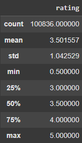
      - Terdapat 100.836 rating dalam dataset, yang menunjukkan volume interaksi pengguna dengan film cukup tinggi.
      - Nilai minimum adalah 0.5, dan maksimum adalah 5.0, yang menunjukkan bahwa pengguna menggunakan seluruh skala rating yang tersedia.
      - Nilai rata-rata rating adalah 3.50 dari skala 0.5–5.0. Ini menunjukkan bahwa secara umum, pengguna cenderung memberikan penilaian yang positif atau netral terhadap film yang mereka tonton.
    - Distribusi Rating
      <br>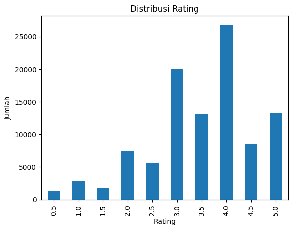
      <br>Secara keseluruhan, grafik di atas menunjukkan distribusi rating dari yang mana rating terkecil adalah 0.5 dan paling besar 0.5. Rating 4.0 merupakan yang paling sering diberikan, menandakan banyak pengguna cenderung memberi penilaian positif.
   - Jumlah Rating per User
     <br>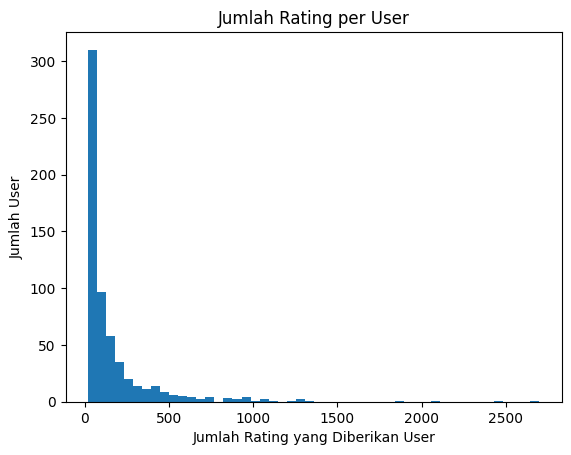
     <br>Grafik di atas menunjukkan jumlah rating yang diberikan oleh user, dimana sebagian besar pengguna memberikan kurang dari 100 rating, menunjukkan banyak pengguna yang kurang aktif.
   - Jumlah Rating per Film
     <br>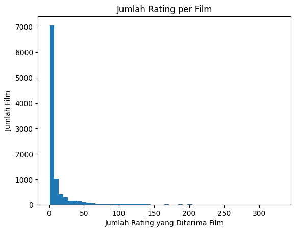
     <br>Grafik di atas menunjukkan jumlah rating yang dimiliki oleh film, dimana sebagian besar film hanya menerima sedikit rating, menunjukkan banyak film kurang populer atau jarang ditonton.
   - Top 10 Film dengan Jumlah Rating Terbanyak
     <br>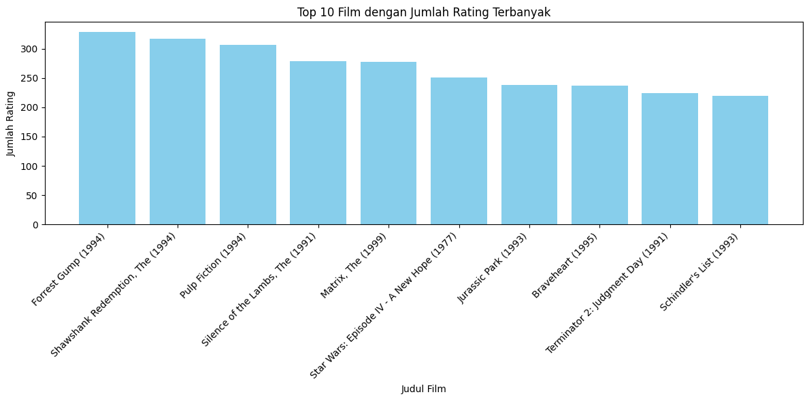
     <br>Grafik di atas  menunjukkan judul-judul film yang menjadi top 10 film dengan rating terbanyak, dimana film klasik dari era 1990-an mendominasi daftar ini.
3. Data df_tags
   - Informasi df_tags
     <br>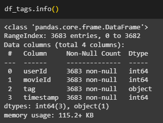
     <br>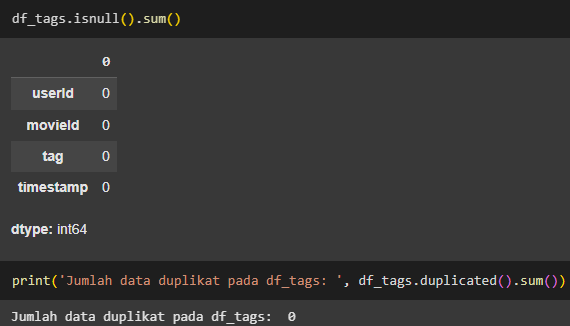
     - Ada 3.683 baris dalam dataset.
     - Terdapat 4 kolom yaitu `userId`, `movieId`, `tag`, dan `timestamp`.
     - Tidak ada missing value dan data duplikat.
   - Jumlah Tag Unik
     <br>
     <br>Output di atas menunjukkan bahwa terdapat 1.589 tag unik pada df_tags.
   - Top 10 Tag yang Paling Sering Muncul
     <br>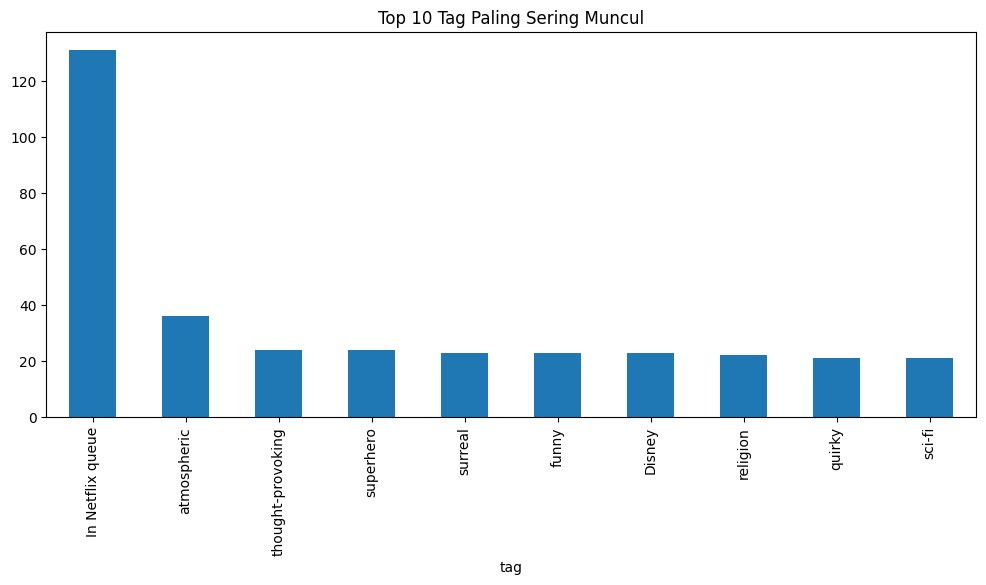
     <br>Tag In Netflix queue muncul paling banyak, jauh melampaui tag lainnya. Ini menunjukkan bahwa banyak pengguna menandai film bukan berdasarkan konten atau genre, tetapi sebagai daftar tontonan atau preferensi pribadi untuk ditonton nanti. Tag-tag berikutnya mencerminkan karakteristik atau tema film.
   - Top 10 Tag yang Paling Jarang Muncul
     <br>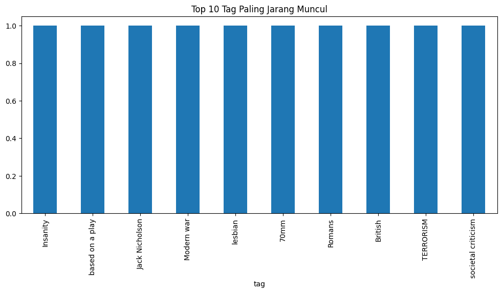
     <br>Semua tag hanya muncul 1 kali, menunjukkan bahwa tag-tag ini sangat jarang digunakan oleh pengguna. Ini bisa menandakan niche interest atau ketidakkonsistenan dalam proses penandaan.
   - Jumlah Tag per Film
     <br>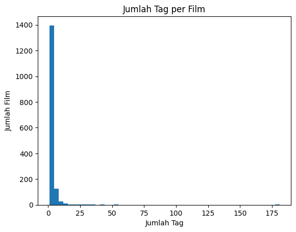
     <br>Sebagian besar film hanya memiliki 1–2 tag, dengan lebih dari 1400 film hanya memiliki 1 tag saja.
   - Jumlah Tag per User
     <br>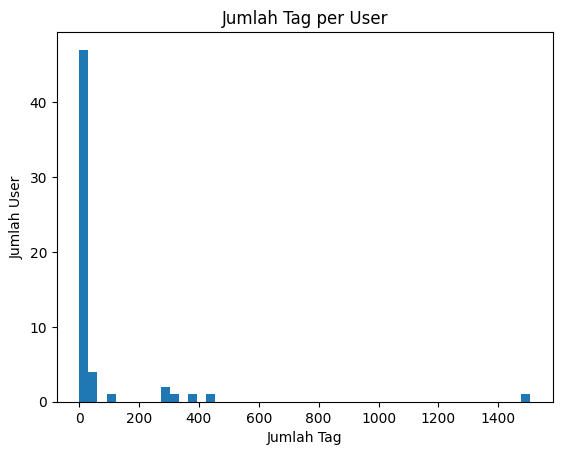
     <br>Sebagian besar user hanya memberikan kurang dari 10 tag, bahkan banyak yang hanya memberi 1–2 tag saja.

## Data Preparation
Pada bagian ini akan dilakukan beberapa tahap persiapan data, yaitu:
1. **Data Preparation untuk Content Based Filtering**
   - **Menghapus data dengan genres = (no genres listed) pada df_movies**
     <br>Pada bagian ini, dilakukan penghapusan untuk data yang `genres` nya adalah (no genres listed), karena film yang tidak memiliki genre tidak memberikan informasi berarti untuk sistem rekomendasi, terutama pada metode Content Based Filtering yang mengandalkan deskripsi konten (genre dan tag) untuk menemukan kesamaan antar item (film). Dimana jumlah data dengan genres = '(no genres listed)' adalah 34, sehingga data tersebut lebih baik dihapus. Adapun jumlah data setelah dihapus menjadi 9.708, yang mana sebelumnya adalah 9.742.
   - **Menggabungkan tag berdasarkan movieId**
     <br>Pada tahapan ini melakukan group by aggregation pada df_tags berdasarkan movieId, lalu menggabungkan tag menjadi satu string. Setiap tag dari pengguna terhadap satu movieId dikumpulkan dan digabungkan menggunakan metode berikut.<br>
     ```python
     tags_agg = df_tags.groupby('movieId')['tag'].apply(lambda x: ' '.join(x)).reset_index()
     ```
     Alasan proses ini dilakukan adalah karena tag dari pengguna merepresentasikan deskripsi subjektif tambahan dari sebuah film. Menggabungkannya memungkinkan sistem mengenali karakteristik film secara lebih kaya.
   - **Menggabungkan df_movies dengan df_tags berdasarkan movieId**
     <br>Pada tahap ini, dilakukan penggabungan df_movies dengan df_tags menggunakan `merge()`. Alasannya adalah untuk menyatukan informasi genre (dari df_movies) dan tag (dari df_tags) agar dapat digunakan bersama-sama dalam representasi konten. Berikut adalah hasilnya:
     <br>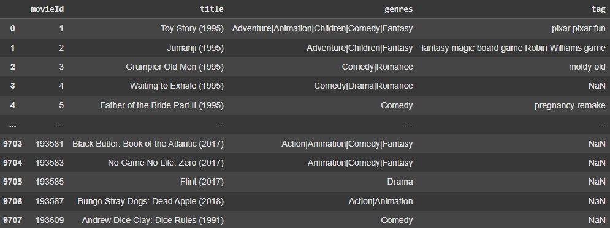
   - **Menangani missing value pada movies_tags**
     <br>Pada tahap ini, dilakukan penanganan missing value pada movie_tags. Dimana,  dapat dilihat pada movies_tags bahwa ada beberapa data yang tag nya tidak memiliki nilai (missing value), sehingga perlu ditangani. Pada tahap ini dilakukan imputasi data kosong (missing value) menggunakan nilai default (fillna('')). Metode ini mengisi nilai NaN pada kolom tag hasil merge dengan string kosong ' '. Alasannya adalah untuk menghindari error saat pengolahan teks, seperti ketika membuat representasi vektor konten. Film tanpa tag tetap dapat diproses hanya dengan informasi genre.
     ```python
     # Mengisi missing value dengan string kosong
     movies_tags['tag'] = movies_tags['tag'].fillna('')
     ```
   - **Memisahkan kolom genres sebagai teks biasa**
     <br>Pada tahap ini dilakukan data transformation, dari format string dengan delimiter | menjadi format teks biasa (natural text). Dimana kolom genres diubah dari 'Action|Adventure|Fantasy' menjadi 'Action Adventure Fantasy'. Alasannya adalah agar genre dapat diolah oleh model representasi teks seperti TF-IDF, yang mengharapkan teks biasa, bukan string dengan delimiter khusus.
   - **Membuat kolom gabungan antara genres dan tag dengan nama content**
     <br>Pada tahap ini kolom genres dan tag digabung menjadi satu kolom content menggunakan +. Karena kolom content akan digunakan sebagai input untuk proses ekstraksi fitur (TF-IDF) pada Content Based Filtering. Penggabungan ini menciptakan representasi yang lebih lengkap dari konten film. 
     
2. **Data Preparation untuk Collaborative Filtering**
   - **Melakukan Encoding pada userId dan movieId**
     <br>Pada tahap ini melakukan encoding menggunakan dictionary mapping (dict). Alasannya adalah karena Collaborative Filtering membutuhkan input berupa indeks numerik yang unik untuk setiap pengguna dan film. Dengan representasi indeks ini, model dapat belajar merepresentasikan setiap user dan item sebagai vektor embedding berdimensi tetap
   - **Melakukan normalisasi pada rating**
     <br>Pada tahap ini, rating dinormalisasi ke rentang 0–1. Alasannya adalah karena normalisasi membantu model memahami preferensi relatif pengguna, dan menghindari bias terhadap pengguna yang cenderung memberikan rating terlalu tinggi atau rendah. Hasil normalisasinya disimpan dalam kolom rating_scaled seperti berikut:
     <br>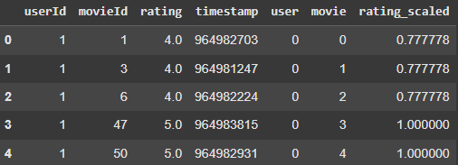
   - **Split data train dan validasi**
     <br>Pada tahap ini dilakukan split data train dan validasi dengan rasio 80:20. Alasannya tahap ini dilakukan adalah untuk mengevaluasi kinerja model Collaborative Filtering secara objektif, penting memiliki data validasi yang tidak digunakan saat pelatihan.
   
## Modeling and Result
Pada tahap ini dilakukan modeling sistem rekomendasi dengan dua pendekatan yaitu Content-Based Filtering dan Collaborative Filtering.

**Kelebihan dan kekurangan pada pendekatan Content-Based Filtering dan Colaborative Filtering**
| **Pendekatan**              | **Kelebihan**   | **Kekurangan**        |
| --------------------------- | ----------------------------------------------------------------------------------------------------------------------------------------- | ----------------------------------------------------------------------------------------------------------------------------------------- |
| **Content-Based Filtering** | - Tidak bergantung pada user lain  <br> - Dapat merekomendasikan item baru <br> - Cocok untuk pengguna baru                               | - Terbatas pada histori user itu sendiri <br> - Rekomendasi kurang bervariasi <br> - Membutuhkan data konten yang bersih dan relevan      |
| **Collaborative Filtering** | - Menangkap pola preferensi secara implisit <br> - Rekomendasi lebih personal dan variatif <br> - Tidak membutuhkan informasi konten film | - Tidak dapat menangani user atau item baru (cold-start) <br> - Membutuhkan data interaksi yang banyak <br> - Rentan terhadap data sparse |

### Model Development dengan Content-Based Filtering
**Parameter**
- stop_words='english': Menghapus kata-kata umum dalam bahasa Inggris agar tidak memengaruhi hasil vektorisasi.
- max_df=0.8: Mengabaikan kata-kata yang muncul di lebih dari 80% dokumen karena dianggap terlalu umum.
- min_df=2: Hanya mempertahankan kata-kata yang muncul di setidaknya 2 dokumen untuk menghindari kata yang sangat jarang.
- ngram_range=(1, 3): Menggunakan unigram, bigram, dan trigram untuk menangkap informasi dari frasa pendek, bukan hanya kata tunggal.

```python
# TF-IDF vectorization
tfidf = TfidfVectorizer(
    stop_words='english',
    max_df=0.8,
    min_df=2,
    ngram_range=(1, 3)
)

tfidf_matrix = tfidf.fit_transform(movies_tags['content'])

# Cosine similarity antar film
cosine_sim = cosine_similarity(tfidf_matrix, tfidf_matrix)

# Mapping judul ke index
movie_indices = pd.Series(movies_tags.index, index=movies_tags['title']).drop_duplicates()

# Simpan dalam DataFrame agar mudah diakses
df_sim = pd.DataFrame(cosine_sim, index=movies_tags['title'], columns=movies_tags['title'])

df_sim.iloc[:5, :5]  # Contoh similarity antar 5 film pertama
```
Sistem ini merekomendasikan film berdasarkan kemiripan konten antar film, seperti genre dan tag. Menggunakan teknik TF-IDF Vectorization untuk mengubah teks (gabungan genre dan tag) menjadi representasi numerik. Kemudian dilakukan cosine similarity untuk mengukur kemiripan antar film. Hasil similarity disimpan dalam bentuk matriks agar dapat dengan cepat mengambil film yang paling mirip berdasarkan judul input.

**Top-N Recommendation Content-Based Filtering**
```python
# Fungsi rekomendasi
def recommend_movies(title, cosine_sim=cosine_sim, top_n=10):
    if title not in movie_indices:
        return []
    idx = movie_indices[title]
    sim_scores = list(enumerate(cosine_sim[idx]))
    sim_scores = sorted(sim_scores, key=lambda x: x[1], reverse=True)
    sim_scores = sim_scores[1:top_n+1]
    movie_indices_rec = [i[0] for i in sim_scores]
    return movies_tags['title'].iloc[movie_indices_rec]

# Contoh penerapan
print("Rekomendasi untuk 'Toy Story (1995)':")
recommend_movies('Toy Story (1995)')
```
Rekomendasi untuk 'Toy Story (1995)':


|  ID   | Title                                              |
|-------|----------------------------------------------------|
| 1757  | Bug's Life, A (1998)                               |
| 2355  | Toy Story 2 (1999)                                 |
| 1706  | Antz (1998)                                        |
| 2809  | Adventures of Rocky and Bullwinkle, The (2000)     |
| 3000  | Emperor's New Groove, The (2000)                   |
| 3568  | Monsters, Inc. (2001)                              |
| 6194  | Wild, The (2006)                                   |
| 6486  | Shrek the Third (2007)                             |
| 6948  | Tale of Despereaux, The (2008)                     |
| 7760  | Asterix and the Vikings (Astérix et les Vikings... |

Tabel tersebut menampilkan top 10 film yang direkomendasikan berdasarkan kemiripannya dengan Toy Story (1995) dalam hal content (genre dan tag).

### Model Development dengan Collaborative Filtering
Sistem ini merekomendasikan film berdasarkan interaksi pengguna dengan item, tanpa melihat kontennya. Menggunakan pendekatan model-based dengan Neural Collaborative Filtering melalui arsitektur RecommenderNet. Model menggunakan embedding layer untuk mewakili user dan movie dalam bentuk vektor berdimensi tetap. Model dilatih menggunakan data rating untuk mempelajari preferensi pengguna terhadap film.

**Parameter**
- Embedding Size: 50
- Loss Function: Mean Squared Error (MSE)
- Optimizer: Adam
- Metrics:
  - Root Mean Squared Error (RMSE)
  - Mean Absolute Error (MAE)
 
Model rekomendasi menggunakan pendekatan Matrix Factorization berbasis embedding yang dibangun dalam class RecommenderNet. Tujuannya adalah untuk mempelajari representasi laten (fitur tersembunyi) dari pengguna dan film.
- `user_embedding` dan `movie_embedding`
  <br>Dua layer Embedding yang digunakan untuk memetakan setiap user dan movie ke dalam vektor berdimensi 50, sebagaimana didefinisikan oleh parameter embedding_size. Vektor-vektor ini mewakili karakteristik laten yang tidak secara eksplisit tersedia dalam data.
- `user_bias` dan `movie_bias`
  <br>Layer embedding satu dimensi yang memberikan bias spesifik untuk masing-masing pengguna dan film. Bias ini membantu menyesuaikan skor prediksi agar lebih akurat terhadap pola rating individual.
- `Metode call`
  <br>Dalam metode ini, vektor embedding dari pengguna (user_vector) dan film (movie_vector) dikalikan elemen-per-elemen dan dijumlahkan dengan tf.reduce_sum() untuk menghasilkan nilai kesesuaian (dot product). Nilai ini kemudian ditambahkan dengan user_bias dan movie_bias, dan hasil akhirnya diaktifkan menggunakan fungsi sigmoid (tf.nn.sigmoid) untuk menghasilkan skor prediksi dalam skala [0, 1].

```python
# Inisialisasi dan compile model
model = RecommenderNet(num_users, num_movies, embedding_size=50)
model.compile(loss=losses.MeanSquaredError(),
              optimizer=optimizers.Adam(learning_rate=0.001),
              metrics=[metrics.RootMeanSquaredError(), metrics.MeanAbsoluteError()])
# Training
history = model.fit(x=x_train, y=y_train,
                    validation_data=(x_val, y_val),
                    epochs=20,
                    batch_size=32)
```

**Top-N Recommendation Content-Based Filtering**
Tahapan ini dilakukan cara berikut:
1. Memilih Pengguna Secara Acak
   <br>Satu pengguna diambil secara acak dari df_ratings untuk menerima rekomendasi personal.
   ```python
   user_id = df_ratings.userId.sample(1).iloc[0]
   ```
3. Mendapatkan Daftar Film yang Belum Ditonton
   <br>Dengan membandingkan semua movieId di dataset dan film yang sudah ditonton user, diperoleh daftar film yang belum pernah dinilai user tersebut.
   ```python
   unwatched_movie_ids = [mid for mid in all_movie_ids if mid not in movies_watched['movieId'].tolist()]
   ```
5. Encoding User dan Movie ke Format Model
   <br>ID pengguna dan ID film diubah ke bentuk numerik sesuai mapping (user_to_user_encoded, movie_to_movie_encoded) yang telah dibuat sebelumnya.
   ```python
   user_encoded = user_to_user_encoded[user_id]
   movie_encoded_ids = [movie_to_movie_encoded[mid] for mid in unwatched_movie_ids if mid in movie_to_movie_encoded]
   ```
7. Prediksi Skor dengan Model
   <br>Model digunakan untuk memprediksi skor preferensi terhadap semua film yang belum ditonton oleh user. Outputnya adalah array prediksi skor rating.
   ```python
   user_movie_array = np.hstack(([[user_encoded]] * len(movie_encoded_ids),np.array(movie_encoded_ids).reshape(-1, 1)))
   predicted_ratings = model.predict(user_movie_array).flatten()
   ```
9. Menentukan Top-10 Rekomendasi
   <br>Dari semua hasil prediksi, diambil 10 film dengan skor prediksi tertinggi menggunakan argsort(), lalu ID film hasil prediksi dikonversi kembali ke movieId asli.
   ```python
   top_indices = predicted_ratings.argsort()[-10:][::-1]
   ```
11. Menampilkan Film yang Direkomendasikan
    <br>Informasi title dan genres dari 10 film rekomendasi ditampilkan ke user sebagai output akhir sistem rekomendasi. Berikut adalah top 10 rekomendasi film untuk user 365:

      |   ID   | Title                                              | Genres                                  |
      |--------|----------------------------------------------------|------------------------------------------|
      |  133   | Congo (1995)                                       | Action, Adventure, Mystery, Sci-Fi       |
      |  192   | Disclosure (1994)                                  | Drama, Thriller                          |
      |  384   | Dazed and Confused (1993)                          | Comedy                                   |
      |  436   | Mrs. Doubtfire (1993)                              | Comedy, Drama                            |
      |  444   | Piano, The (1993)                                  | Drama, Romance                           |
      |  594   | Twister (1996)                                     | Action, Adventure, Romance, Thriller     |
      |  974   | Highlander (1986)                                  | Action, Adventure, Fantasy               |
      | 2701   | Shanghai Noon (2000)                               | Action, Adventure, Comedy, Western       |
      | 2743   | For a Few Dollars More (Per qualche dollaro in... | Action, Drama, Thriller, Western         |
      | 5938   | Wedding Crashers (2005)                            | Comedy, Romance                          |


## Evaluation
### Evaluasi Content-Based Filtering
**Metrik yang digunakan**
1. Precision\@K, yaitu mengukur proporsi item yang relevan dari total K rekomendasi yang diberikan.

- Formula:

$$
\text{Precision@K} = \frac{|\text{Recommended Items} \cap \text{Relevant Items}|}{K}
$$

   - Keterangan:
     - Recommended Items: Daftar item yang direkomendasikan oleh sistem kepada pengguna (sebanyak K item).
     - Relevant Items: Daftar item yang dianggap relevan oleh pengguna (misalnya berdasarkan histori interaksi/rating tinggi).
     - ∩ (Irisan): Item yang direkomendasikan dan juga relevan.
     - K: Jumlah item yang direkomendasikan (misal: 10).
     - Precision@K: Mengukur akurasi sistem dalam merekomendasikan item yang benar-benar relevan dari total item yang diberikan.
       
2. Recall\@K, yaitu mengukur proporsi item relevan yang berhasil direkomendasikan dari seluruh item relevan yang tersedia untuk pengguna.
- Formula:
     
$$
\text{Recall@K} = \frac{|\text{Recommended Items} \cap \text{Relevant Items}|}{|\text{Relevant Items}|}
$$

   - Keterangan:
     - Recommended Items ∩ Relevant Items: Jumlah item relevan yang berhasil ditemukan oleh sistem.
     - Relevant Items: Total item relevan yang dimiliki pengguna (berdasarkan ground truth).
     - Recall@K: Mengukur kemampuan sistem dalam menemukan semua item relevan milik pengguna dari total yang tersedia.
    
**Hasil evaluasi**
- Precision@10: 1.0000
- Recall@10: 0.0020

Analisis:
- Precision@10: 1.0000, menunjukkan bahwa dari 10 film yang direkomendasikan, seluruhnya dianggap relevan berdasarkan kemiripan genre dan tag dengan Toy Story (1995). Ini menunjukkan bahwa sistem sangat tepat dalam memilih film yang relevan.
- Recall@10: 0.0020, berarti bahwa dari seluruh film yang secara genre dan tag dianggap mirip dengan Toy Story, sistem hanya berhasil menangkap sekitar 0.2% saja. Ini menunjukkan bahwa sistem masih memiliki cakupan (coverage) yang rendah.

### Evaluasi Collaborative Filtering
**Metrik yang digunakan**
1. RMSE (Root Mean Squared Error)
- Formula

$$
\text{RMSE} = \sqrt{\frac{1}{n} \sum_{i=1}^{n}(y_i - \hat{y}_i)^2}
$$

- Keterangan:
  - $n$ = jumlah total data (jumlah prediksi)
  - $y_i$ = nilai rating aktual pada data ke-i
  - $\hat{y}_i$ = nilai rating hasil prediksi pada data ke-i
  - RMSE mengukur akar dari rata-rata kuadrat selisih antara prediksi dan nilai aktual.

Semakin kecil RMSE, semakin baik akurasi model dalam memprediksi rating.

2. MAE (Mean Absolute Error)
- Formula

$$
\text{MAE} = \frac{1}{n} \sum_{i=1}^{n}|y_i - \hat{y}_i|
$$

- Keterangan:
  - $n$, $y_i$, dan $\hat{y}_i$ sama seperti pada RMSE.
  - MAE menghitung **rata-rata dari selisih absolut** antara rating aktual dan prediksi.
  - Nilainya lebih mudah dipahami karena tidak menggunakan kuadrat atau akar.

Semakin kecil MAE, semakin kecil kesalahan rata-rata model.


**Hasil evaluasi**
1. RMSE
- RMSE Train:  0.06599874794483185
- RMSE Val:  0.20555078983306885
- Visualisasi
  <br>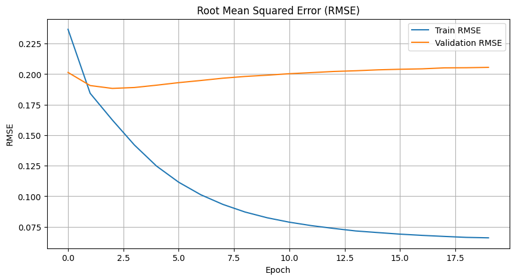

Analisis:
- Train RMSE: 0.0659
- Validation RMSE: 0.2056
- Grafik menunjukkan bahwa:
  - RMSE training menurun konsisten dari awal hingga akhir epoch, menunjukkan bahwa model belajar dengan baik pada data pelatihan.
  - RMSE validasi menurun sedikit hingga sekitar epoch ke-2, kemudian mulai meningkat perlahan setelahnya.
- Terdapat indikasi overfitting pada model, yang terlihat dari perbedaan antara nilai RMSE training dan RMSE validasi. Nilai RMSE training terus menurun secara konsisten, menandakan model semakin baik dalam mempelajari data pelatihan. Namun, RMSE validasi hanya menurun pada beberapa epoch awal (sekitar epoch ke-2), lalu meningkat perlahan setelahnya. Hal ini menunjukkan bahwa model mulai kehilangan kemampuan generalisasi terhadap data baru, karena terlalu menyesuaikan diri dengan data pelatihan.

2. MAE
- MAE Train:  0.05029238387942314
- MAE Val:  0.15763945877552032
- Visualisasi
  <br>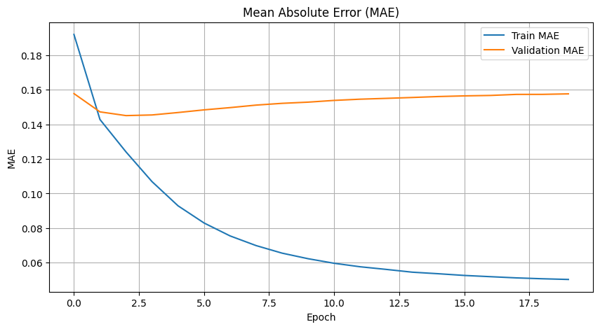

Analisis:
- Train MAE: 0.0503
- Validation MAE: 0.1576
- Grafik menunjukkan bahwa:
  - MAE training juga menurun tajam dan konsisten, mendekati nilai minimum sekitar 0.05.
  - MAE validasi mencapai titik terendah di sekitar epoch ke-2 hingga ke-3, lalu meningkat perlahan, stabil di sekitar 0.157.
- Sama seperti RMSE, grafik MAE menunjukkan overfitting setelah beberapa epoch awal. Kecenderungan validasi MAE untuk stagnan atau naik menandakan model hanya bagus pada data training.

## Conclusion
Proyek ini berhasil membangun dua jenis sistem rekomendasi film, yaitu Content-Based Filtering (CBF) dan Collaborative Filtering (CF), dengan menggunakan Movie Rating Dataset dari Kaggle. Hasil yang diperoleh menunjukkan bahwa kedua pendekatan memiliki keunggulan dan tantangan masing-masing.

**Content-Based Filtering**
<br>Sistem CBF menggunakan data film berupa genre dan tag untuk menghasilkan rekomendasi berdasarkan kemiripan konten. Dengan pendekatan ini, sistem dapat memberikan rekomendasi yang sangat akurat secara relevansi konten—terbukti dari nilai Precision@10 sebesar 1.0000, yang berarti semua rekomendasi sangat relevan terhadap film input seperti Toy Story (1995). Namun, cakupan sistem masih sangat rendah dengan nilai Recall@10 hanya 0.0020, menunjukkan bahwa hanya sebagian kecil film relevan yang berhasil direkomendasikan. Hal ini menunjukkan bahwa meskipun sistem tepat, variasi rekomendasinya terbatas.

**Collaborative Filtering**
<br>Sistem CF menggunakan interaksi pengguna dan film (dalam bentuk rating) untuk mempelajari pola preferensi. Model dibangun dengan pendekatan Neural Collaborative Filtering (NCF) yang memanfaatkan layer embedding dan berhasil mencapai hasil evaluasi yang cukup baik:
- RMSE pada data validasi: 0.2056
- MAE pada data validasi: 0.1576

Nilai-nilai ini menunjukkan bahwa prediksi rating oleh model cukup dekat dengan nilai aktual. Namun, perbedaan mencolok antara metrik pada data training dan validasi menunjukkan indikasi overfitting, di mana model terlalu menyesuaikan diri pada data latih dan kehilangan kemampuan generalisasi terhadap data baru.

**Perbandingan dan Implikasi**
- CBF cocok untuk pengguna baru atau film baru karena tidak bergantung pada data interaksi historis, tetapi memiliki rekomendasi yang kurang variatif.
- CF mampu memberikan rekomendasi yang lebih personal dan beragam, tetapi memerlukan data interaksi dalam jumlah besar dan rentan terhadap masalah cold-start.

**Kesimpulan dan Saran**
<br>Kedua pendekatan memiliki kelebihan dan kekurangan yang saling melengkapi. Untuk pengembangan lebih lanjut, disarankan untuk menggabungkan keduanya dalam pendekatan hybrid recommendation system, agar mampu mengatasi keterbatasan masing-masing metode dan meningkatkan kualitas rekomendasi secara keseluruhan.
